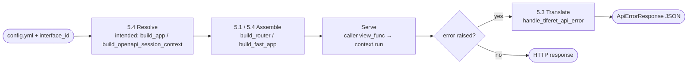

**Status:** Draft · **Domain:** `tiferet-fast` · **Code:** `tiferet_fast/` · **Branch:** `v1.x-proto`
**Grounded against:** `tiferet-openapi v1.0.0` (GitHub Latest, `main`) · `tiferet v2.1.0` (last minor)
**Companion:** `docs/domain-vision.md`

# tiferet-fast: Core Domain Distillation

## 1. Purpose of this document
The vision statement says tiferet-fast's job is to make "pick FastAPI" free for a team already using tiferet-openapi's shared declaration. This document says how the domain does that today, exactly: its vocabulary, its one behavior pipeline, and — because this distillation was commissioned to ground tiferet-fast's own v1 beta — an honest accounting of where the code has already drifted from the floors that beta should sit on. It is the reference a future RFP should be measured against, not a design proposal itself.

Those floors, as of this refresh:

- **`tiferet-openapi v1.0.0`** is now a full GitHub Latest release on `main` (tag `v1.0.0`, published after the proto cluster `TOA1-RFP-001`–`005` was reconstructed onto trunk). The earlier proto pin `tiferet-openapi>=1.0.0b1` is no longer the catalog this beta should target.
- **`tiferet v2.1.0` is the last minor.** A later `v2.1.1` patch exists (tester-grammar / repo dogfood). tiferet-openapi's unreleased `main` (post-`v1.0.0`, PR #61) already floors at `tiferet>=2.1.1` for that reason; this beta does not chase that unreleased bump. The v1.0.0 *release* of tiferet-openapi still declares `tiferet>=2.0.3`. tiferet-fast's own floor for the beta is the last minor: `tiferet>=2.1.0`.

## 2. The core domain, restated precisely
tiferet-fast's core domain is **turning an already-declared router/route description into a running, documented FastAPI application, and translating a domain error into the FastAPI exception shape a client expects, without redeclaring anything tiferet-openapi already declared.**

The domain has one fixed shape:

> **Resolve** (interface + declared services) → **Assemble** (one `APIRouter` per declared `ApiRouter`, included into a `FastAPI` app) → **Serve** (route a request to the caller's `view_func`) → **Translate** (a raised error becomes an `HTTPException`)

and one axis of variation the codebase does not currently name for itself:

1. **Consumed-vs-current base shape** — whether the class tiferet-fast subclasses, the compose path it uses to realize that class, and the dependency floors it declares, match `tiferet-openapi v1.0.0` and `tiferet v2.1.0`. This is not a designed axis; it is where `FastApiContext` and `build_fast_app` have fallen behind both floors (Section 5.2, Section 5.4, Section 8).

## 3. Ubiquitous language
**`FastApiContext`** (`tiferet_fast/contexts/fast.py`) — the FastAPI-specific runtime context. Declared as `class FastApiContext(OpenApiContext)`. It does not override `handle_error`; the inherited hub still raises `TiferetAPIError` with `.status_code` attached, and Translate is `handle_tiferet_api_error` registered once on the assembled FastAPI app, returning `ApiErrorResponse` JSON. Its tests still construct it with retired `AppInterfaceContext` kwargs (`interface_id`, `features`, `errors`, `logging`, `get_route_evt`, …) and still call `parse_request` / `handle_response` — neither of which exists on `OpenApiSessionContext` in tiferet-openapi v1.0.0 (Section 5.2).

**`FastRequestContext`** (`tiferet_fast/contexts/request.py`) — `FastRequestContext = OpenApiRequestContext`, a direct alias with no FastAPI-specific behavior added.

**Blueprint functions** (`tiferet_fast/blueprints/fast.py`) — the composable functions that replace the retired `FastApiBuilder` class:
- `resolve_model(model_path)` — imports a Pydantic model class by dotted path, or returns `None` for an empty path. Independent implementation of the same idea as tiferet-openapi's `_resolve_model_schema`, but simpler: it does not check for `model_json_schema` and does not raise a `TiferetError` on failure — a bad path surfaces as a raw `ModuleNotFoundError` or `AttributeError` at app-build time (Section 5.1).
- `get_routers(service_provider)` — resolves and executes the `get_routers_evt` from a `ServiceProvider`.
- `build_router(router, view_func, **kwargs)` — builds one `fastapi.routing.APIRouter` from an `ApiRouter`, adding one `add_api_route` call per declared `ApiRoute`, with `tags=route.tags or [router.name]` and `response_model=resolve_model(route.response_model)`.
- `build_fast_app(interface_id, view_func, **parameters)` (alias: `FastAPI`) — the one-call assembly path. Today it imports `resolve_interface` / `realize_interface` / `create_service_provider` from `tiferet.blueprints.main` and `ServiceProvider` from `tiferet.di`, then pre-seeds constants before types (a documented workaround for DI eager wiring — Section 5.4). None of those names exist on `tiferet v2.1.0`.
- `run(interface_id, view_func, **parameters)` — a plain alias for `build_fast_app`.

**Interface config** — an `interfaces.<id>` entry pointing `module_path`/`class_name` at `tiferet_fast.contexts.fast.FastApiContext`, with `attrs` wiring `get_routers_evt`, `get_route_evt`, `get_status_code_evt`, and `openapi_service` to their `tiferet_openapi` implementations. tiferet-fast contributes no config vocabulary of its own beyond this wiring.

## 4. What the domain reads / operates on
tiferet-fast reads only what its assemble path and tiferet-openapi's declared `ApiRouter`/`ApiRoute` objects already produced — it opens no YAML file itself and defines no schema of its own. The one piece of data it interprets independently is a route's `response_model` string, via its own `resolve_model` (Section 3), which is a narrower, unvalidated cousin of tiferet-openapi's `_resolve_model_schema`.

Today that assemble path still goes through `tiferet.blueprints.main.resolve_interface` / `realize_interface`. On `tiferet v2.1.0` those names are gone: `tiferet/blueprints/main.py` does not exist, public composition is `build_app` / `App` from `tiferet.blueprints.app`, and tiferet-openapi v1.0.0 adds `build_openapi_session_context` / `create_openapi_request_context` as the OpenAPI-specific compose helpers. Section 5.4 records this as a live break, not as the intended read path.

## 5. The behaviors

### 5.1 Assembling routers
*Turn each declared `ApiRouter` into a `fastapi.routing.APIRouter` with routes and Swagger metadata attached.*

`build_router` (`tiferet_fast/blueprints/fast.py:67-107`) creates one `APIRouter(prefix=router.prefix, tags=[router.name])` and calls `add_api_route` once per `ApiRoute`, passing `methods`, `status_code`, `summary`, `description`, `tags` (falling back to `[router.name]`), and a `response_model` resolved via `resolve_model`.

**Verdict:** agnostic to which router/route data is behind it — this reads only `ApiRouter`/`ApiRoute` fields that already exist. Not yet reconciled with tiferet-openapi's own model-resolution failure mode: tiferet-openapi's RFP-004 made `_resolve_model_schema` raise `TiferetError('OPENAPI_MODEL_RESOLUTION_FAILED', ...)` on a bad `model_path`; `resolve_model` here still raises a raw `ModuleNotFoundError`/`AttributeError` instead, which is a divergent, less domain-shaped failure for the same kind of misconfiguration (confirmed by `blueprints/tests/test_fast.py::test_resolve_model_invalid_module`/`test_resolve_model_invalid_class`, which assert exactly those raw exception types).

### 5.2 Subclassing the shared session context
*Extend whatever base class tiferet-openapi ships for status-aware response and error handling, and translate its result into an `HTTPException`.*

`FastApiContext(OpenApiContext)` (`tiferet_fast/contexts/fast.py:16`) imports `OpenApiContext` from the top-level `tiferet_openapi` package.

**Verdict — confirmed against the v1.0.0 release, not just proto: this import target no longer exists.** tiferet-openapi `v1.0.0` on `main` exports `OpenApiSessionContext` and `OpenApiRequestContext` (plus `build_openapi_session_context` / `create_openapi_request_context`). Grepping the entire `tiferet_openapi/` package for `OpenApiContext` returns zero matches — there is no deprecated alias for the class name (unlike `create_docs_handler`, which v1.0.0 does keep as a one-release alias). `tiferet-fast`'s own commit `b12a269` ("update to tiferet-openapi 1.0.0b1", #49) bumped the `pyproject.toml` pin to `tiferet-openapi>=1.0.0b1` but did not touch `contexts/fast.py` — the rename was missed, not deferred, and the subsequent v1.0.0 trunk reconstruction did not land here either.

The break is more than a class rename. On v1.0.0, `OpenApiSessionContext.__init__` (`tiferet_openapi/contexts/openapi.py:37-87`) takes `get_dependency` plus handler callables (`get_route_handler`, `get_status_code_handler`, `get_routers_handler`) and forwards the hub slots to `AppSessionContext`. There is no `parse_request` on the hub; request construction lives in `create_openapi_request_context`. Response pairing is `build_response`, not `handle_response`. `tiferet-fast`'s context tests (`contexts/tests/test_fast.py`) still construct `FastApiContext` with `interface_id` / `features` / `errors` / `logging` / `get_route_evt` and still assert `parse_request` / `handle_response` — that fixture shape matches the retired `AppInterfaceContext`, not v1.0.0.

This remains masked in the local dev environment: the installed `tiferet-openapi==1.0.0b1` wheel in `tiferet-fast/.venv` still exports `OpenApiContext` and predates both the rename and the handler-callable constructor, despite sharing a version string with an earlier proto tag. Local tests pass against that stale build, not against GitHub Latest `v1.0.0`. Reinstalling against the published `tiferet-openapi==1.0.0` (and `tiferet>=2.1.0`) should be the first thing a future RFP session confirms before trusting green tests here.

### 5.3 Handling errors
*Convert a raised `TiferetAPIError` into `ApiErrorResponse` JSON at the FastAPI boundary.*

`handle_tiferet_api_error` (`tiferet_fast/assets/errors.py`) is a named Starlette `ExceptionHandler` of shape `(request, exc)`. It builds `ApiErrorResponse(error=exc.name, message=exc.message or '')` and returns `JSONResponse(content=payload.model_dump(), status_code=getattr(exc, 'status_code', 500))`. `build_fast_app` registers it once with `fast_app.add_exception_handler(TiferetAPIError, handle_tiferet_api_error)`. `FastApiContext` does not override `handle_error`; the inherited `OpenApiSessionContext.handle_error` still raises `TiferetAPIError` with `.status_code` attached. View functions do not catch the error. The handler does not raise `HTTPException`; FastAPI's default `{"detail": ...}` envelope is not the client body.

**Verdict:** Translate belongs at the FastAPI app-level exception handler, not on the session hub. Status resolution stays upstream. The previous "HTTPException conversion is sound" verdict is no longer true: that conversion wrapped `{error, message}` in FastAPI's `{"detail": ...}` envelope and put FastAPI types inside the context.

### 5.4 Assembling the app
*Resolve an interface, pre-seed a service provider, and assemble a runnable `FastAPI` app with middleware and routers.*

`build_fast_app` (`tiferet_fast/blueprints/fast.py:111-173`) currently imports `resolve_interface`, `realize_interface`, and `create_service_provider` from `tiferet.blueprints.main`, plus `ServiceProvider` from `tiferet.di`. It builds a combined type map from `app_interface.get_service_type_mapping()` and `default_services`, separates non-type constants from types, and creates the `ServiceProvider` pre-seeded with constants only — a documented workaround (commit `b12a269`) for `DynamicServiceProvider`'s eager wiring resolving types before their constant dependencies exist. It attaches `starlette_context`'s `RequestIdPlugin`/`CorrelationIdPlugin` middleware, then includes one `build_router` result per router `get_routers` returns.

**Verdict — confirmed against `tiferet v2.1.0`: this assemble path cannot import.** On that minor, `tiferet/blueprints/main.py` does not exist; `tiferet.di` exports `ServiceContainer` / `ServiceResolver` (and the `DI*` implementations), not `ServiceProvider`; and `git grep` for `resolve_interface`, `realize_interface`, `create_service_provider`, and `ServiceProvider` under `tiferet/` at tag `v2.1.0` returns nothing. The constants-before-types workaround solved a real bug against the retired DI engine; it is not a substitute for reconstructing assemble onto `build_app` / `compose_session_context` / `build_openapi_session_context`. The `get_routers(service_provider)` helper has the same dependency.

### 5.5 Publishing documentation — native FastAPI generation is authoritative
*Whether FastAPI's own native OpenAPI generation is reconciled with tiferet-openapi's `generate_spec`/`get_docs_spec`.*

Decided: it is not reconciled, and that is the intended shape. `build_fast_app` constructs `FastAPIApp(title=f'{interface_id} API', middleware=middleware)` with no `openapi_url`, `docs_url`, or `redoc_url` kwargs and does not assign `fast_app.openapi` or `fast_app.openapi_schema`. FastAPI's `setup()` therefore keeps `/openapi.json`, `/docs`, and `/redoc`. Native schema is derived from the `summary` / `description` / `tags` / `response_model` kwargs `build_router` already passes to `add_api_route`. The identifiers `get_docs_spec`, `generate_spec`, and `create_docs_handler` do not appear in production modules under `tiferet_fast/assets/`, `tiferet_fast/blueprints/`, or `tiferet_fast/contexts/`. RFP-001 inherits `get_docs_spec` on `FastApiContext`; assemble does not invoke it. A consumer who wants the tiferet-openapi dict may still call `interface_context.get_docs_spec(...)` themselves — that is the hub accessor, not this adapter's HTTP Publish.

**Verdict:** native FastAPI generation is authoritative; `get_docs_spec` is unused by this adapter. tiferet-openapi's Generate/Publish pair remains a data accessor for adapters that cannot produce a spec from their own routing table (companion `docs/core-domain-distillation.md` Section 5.3/5.4). Flask needed that accessor; FastAPI does not. This adapter does not replace `app.openapi`, does not mount a second docs route, does not vendor Swagger UI, and does not add a `swagger=` flag.

## 6. How the behaviors compose
Resolve runs once, at app-build time. Assemble runs once per declared router, also at app-build time, and depends on Resolve. Serve runs once per incoming request, driven entirely by the caller-supplied `view_func`, and depends on Assemble having registered the matching route. Translate is a parallel error path that only fires when the realized context's `run` path raises `TiferetAPIError`; `handle_tiferet_api_error` on the assembled FastAPI app renders `ApiErrorResponse` JSON.

Today's code still draws Resolve through `tiferet.blueprints.main` (Section 5.4); the diagram names the intended v2.1.0 path. Publish (Section 5.5) is FastAPI-native: assemble does not call `get_docs_spec`.

## 7. Relationships / cross-boundary rules
`FastApiContext` is supposed to relate to tiferet-openapi's session context purely through Python inheritance — adding no new collaborators of its own and receiving route/status/routers lookups through whatever constructor the base class defines. On v1.0.0 that constructor is handler callables plus `get_dependency`, not DomainEvent instances; Section 5.2's break is therefore both a missing class name *and* a changed injection shape. The blueprint functions are supposed to relate to the context only by realizing it once and handing the same resolved session to `get_routers` and the view-function closure. There is no second, independent path that constructs routers or a context.

## 8. The agnostic core and the variable edge
**Agnostic — built once, shared regardless of which interface or config is loaded:**
- `build_router`'s translation of `ApiRoute`/`ApiRouter` fields into `add_api_route` keyword arguments.
- `handle_tiferet_api_error`'s translation of a raised `TiferetAPIError` into `ApiErrorResponse` JSON, registered once on the assembled FastAPI app.

**Variable — one definition per consuming application:**
- The `config.yml` content itself (routers, routes, services, features, errors).
- The `view_func` a consuming application supplies.
- Which `response_model`/`request_model` dotted paths are declared, and whether they resolve.

**Currently entangled or drifted — the honest inventory:**
- **`FastApiContext` subclasses a class name (`OpenApiContext`) that no longer exists in tiferet-openapi v1.0.0.** Confirmed against GitHub Latest, not only proto (Section 5.2). The v1.0.0 constructor is handler-callable + `get_dependency`, not `get_*_evt` DomainEvents; tests still use the retired `AppInterfaceContext` fixture shape.
- **`build_fast_app` imports a tiferet compose API that does not exist at v2.1.0.** `tiferet.blueprints.main`, `ServiceProvider`, `resolve_interface`, `realize_interface`, and `create_service_provider` are all gone (Section 5.4). Reconstructing assemble is a second, independent break from the class rename.
- **`resolve_model`'s failure mode has diverged from `_resolve_model_schema`'s.** tiferet-openapi v1.0.0 raises `TiferetError('OPENAPI_MODEL_RESOLUTION_FAILED', ...)` on a bad `model_path`; `tiferet-fast`'s own `resolve_model` still raises raw Python exceptions, and its own tests assert that raw shape (Section 5.1).
- **Native FastAPI schema generation is authoritative; `generate_spec`/`get_docs_spec` are unused by this adapter.** Decided by TFA1-RFP-003 (#53). `AGENTS.md`/`README.md` describe `response_model` resolution as sufficient for native Swagger schema generation; that is the intended permanent shape, not a gap (Section 5.5).
- **`create_docs_handler`/`get_docs_spec` are not referenced anywhere in this package.** tiferet-openapi v1.0.0's one-release `create_docs_handler` alias assumed a consumer might already be depending on the old name; `tiferet-fast` is not such a consumer today, which lowers that risk for this adapter.
- **Declared floors are behind the beta this document now grounds against.** `pyproject.toml` still has `tiferet-openapi>=1.0.0b1` and no direct `tiferet` pin; `requirements.txt` still has `tiferet>=2.0.0b1`; `AGENTS.md`/`README.md` still describe `v0.4.0` / `tiferet-openapi>=0.1.3` / `FastApiContext(OpenApiContext)`. The beta floors this refresh names are `tiferet-openapi>=1.0.0` and `tiferet>=2.1.0` (last minor — not the unreleased `tiferet>=2.1.1` bump on tiferet-openapi `main` after v1.0.0).

## 9. Boundaries
**Inside the domain:** assembling FastAPI routers and a runnable `FastAPI` app from tiferet-openapi's already-declared routers/routes; realizing the FastAPI session context through tiferet / tiferet-openapi composition; translating a raised `TiferetAPIError` into `ApiErrorResponse` JSON via the app-level exception handler.

**Outside the domain, and who owns it instead:**
- Declaring routes, request/response shapes, and error mappings — owned entirely by `tiferet-openapi` (`ApiRoute`, `ApiRouter`, `OpenApiYamlRepository`, the three domain events).
- Generating an OpenAPI specification and serving a documentation page from tiferet-openapi Generate — `OpenApiSessionContext.generate_spec`/`get_docs_spec` exist in `tiferet-openapi`; this adapter does not call either. HTTP docs stay FastAPI-native `/openapi.json` / `/docs` / `/redoc` (Section 5.5).
- What a route's business logic does once a request reaches it — owned by the `view_func` and the feature it triggers, not by anything in `tiferet_fast`.

## 10. Where this leads
1. **Reconstruct `FastApiContext` onto `OpenApiSessionContext` as shipped in tiferet-openapi v1.0.0.** Not a rename-only patch: constructor, tests, and the missing `parse_request`/`handle_response` surface all have to move with it (Section 5.2). Verify against the published `tiferet-openapi==1.0.0` wheel, not the stale local `1.0.0b1` install.
2. **Reconstruct `build_fast_app` onto tiferet v2.1.0 composition.** `tiferet.blueprints.main` / `ServiceProvider` are gone; the replacement path is `build_app` plus tiferet-openapi's `build_openapi_session_context` / `create_openapi_request_context` (Section 5.4). This is independent of item 1 and equally blocking for the beta.
3. **Raise the declared floors to `tiferet-openapi>=1.0.0` and `tiferet>=2.1.0`.** v2.1.0 is the last minor; do not floor at `2.1.1` for this beta. Refresh `pyproject.toml`, `requirements.txt`, `AGENTS.md`, and `README.md` to match (Section 8).
4. **Publish is decided: native FastAPI generation is authoritative.** TFA1-RFP-003 (#53) locks this. `build_fast_app` does not call `get_docs_spec`, does not replace `app.openapi`, and does not mount a second docs route. `/docs` is FastAPI-native; `get_docs_spec` is not wired (Section 5.5).
5. **Reconcile `resolve_model`'s failure mode with `_resolve_model_schema`'s**, once items 1–2 are resolved, so a bad model path fails the same domain-shaped way in both packages (Section 8).
